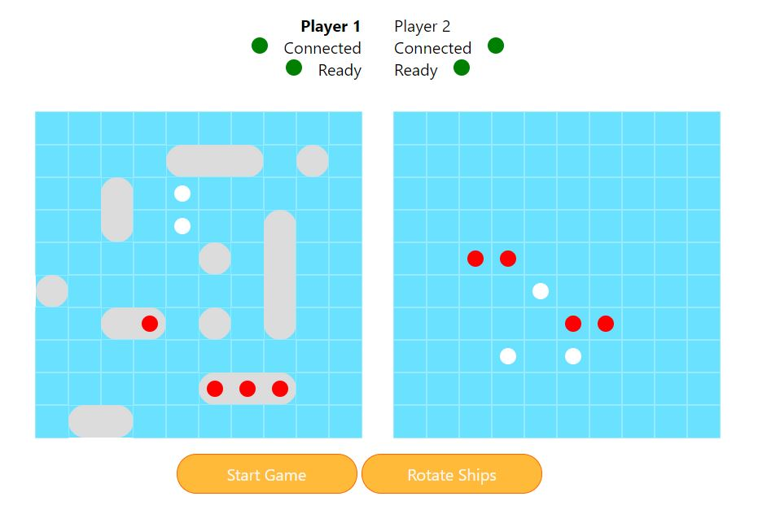

## Battle Ships Game
### Multiplayer game made in JavaScript

## Technologies
- JavaScript
- socket.io
- express
## Installation
In the project directory run: `npm install`. Then in the same directory run: `node ./server.js`. Last step is to open http://localhost:8080 to view it in the borwser. Game is intended for two players, so you can open app in second window to test it.